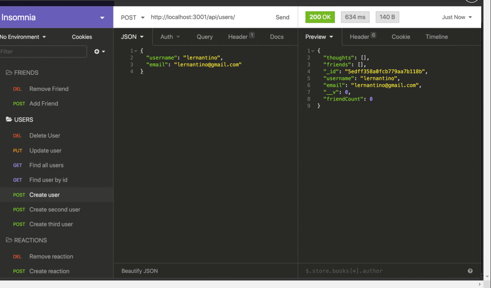

# social-network-api

Create mongoose models of users and thoughts

Create controllers to make logic for routes in insomnia

Create the api routes to add update view and delete all thoughts users and reactions

